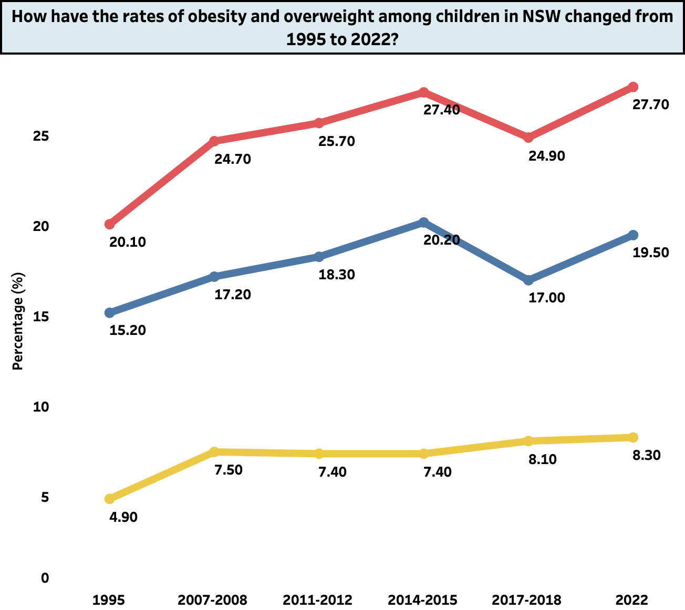
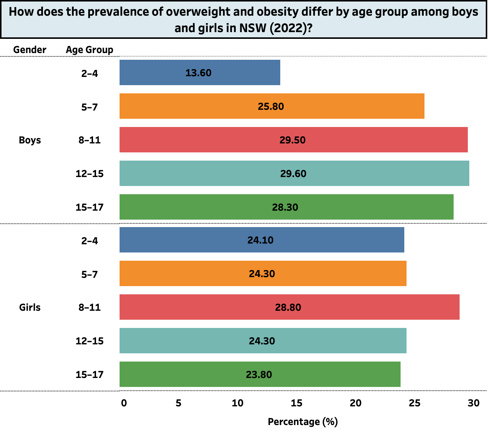
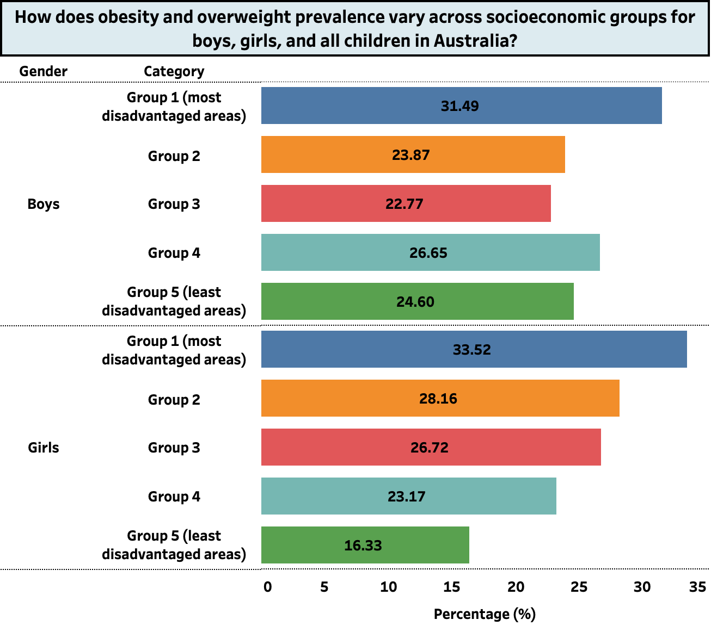

# Childhood Obesity Analysis in NSW

### Project by Muhammad Pasha Arrighi Effendi

---

## Project Overview
This project investigates the factors and trends influencing childhood obesity in New South Wales (NSW). Using data from the NSW Population Health Survey, I explore variations in obesity rates across age, gender, socioeconomic backgrounds, and geographic locations.

---

## Introduction
Childhood obesity is a pressing health issue characterized by excessive fat deposits that increase health risks. This analysis differentiates between "overweight" and "obese" statuses, with obesity posing more severe health risks.

---

## Research Questions
1. How have childhood obesity and overweight trends changed over time?
2. How does the rate of obesity differ across various age and gender groups?
3. How does obesity differ across socioeconomic groups?
4. How do obesity rates differ across geographic locations?

---

## Methodology
- **Scope and Focus:**  
   - **Age:** Identifying high-risk age groups  
   - **Gender:** Comparing rates between boys and girls  
   - **Geographic Location:** Analyzing obesity rates in cities vs. regional areas  
   - **Socioeconomic Status:** Examining links between income, education, and obesity

- **Data Source:** NSW Population Health Survey  
- **Data Cleaning (Tableau Prep):**  
   - Handling missing values  
   - Correcting data types  
   - Addressing inconsistencies  
   - Data validation  

- **Analytics Tools:**  
   - Excel and Tableau for analytics and dashboard creation  

---

## Visualization and Analysis

### [Click Here to Access The Dashboard](https://public.tableau.com/views/AnalysisofChildhoodObesityinNSW/Dashboard1?:language=en-US&:sid=&:redirect=auth&:display_count=n&:origin=viz_share_link)

### Trends Over Time

Analyzing how childhood obesity and overweight rates have evolved from 1995 to 2022.

### Age and Gender Differences

Comparison of obesity rates between boys and girls across different age groups.

### Socioeconomic Groups

Examining how socioeconomic factors influence obesity prevalence.

### Geographic Location

.png)

Comparing obesity rates in metropolitan areas versus regional and remote regions.

---

## Findings
- **Socioeconomic Disadvantage:** Higher risk among children from lower-income families.
- **Regional Disparities:** Higher obesity rates in outer regional and remote areas.
- **Gender Differences:** Girls in regional areas are more vulnerable.
- **Age Trends:** Obesity rates peak in middle childhood (ages 8-11).
- **Rising Trend:** An overall increase in childhood obesity rates over the years.

---

## Recommendations
1. Improve dietary habits.
2. Increase physical activity.
3. Set achievable treatment goals.
4. Support children during weight loss therapy.
5. Implement targeted and early interventions.
6. Continuously monitor at-risk groups.

---

## Conclusion
Addressing childhood obesity requires a focus on these trends and disparities to create effective, targeted interventions. This is essential for promoting a healthier future for all children.

---
